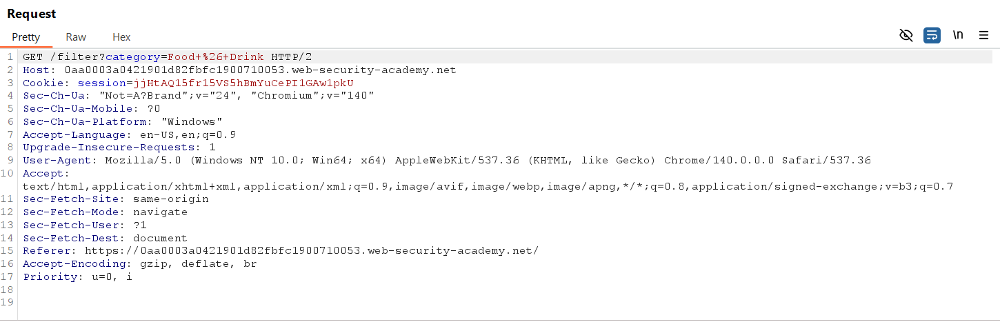

# Lab: SQL injection vulnerability in WHERE clause allowing retrieval of hidden data

**APPRENTICE**

This lab contains a SQL injection vulnerability in the product category filter. When the user selects a category, the application carries out a SQL query like the following:

SELECT * FROM products WHERE category = 'Gifts' AND released = 1
To solve the lab, perform a SQL injection attack that causes the application to display one or more unreleased products.

## Write-up

Ở đây thì có thể thấy trường "category="
có thể bị sqli. nhiệm vụ của lab là làm thế nào để hiển thị được toàn bộ được sản phẩm.
ở đây payload của em sẽ sử dụng ' OR 1=1 -- để tạo mệnh đề True và show ra toàn bộ