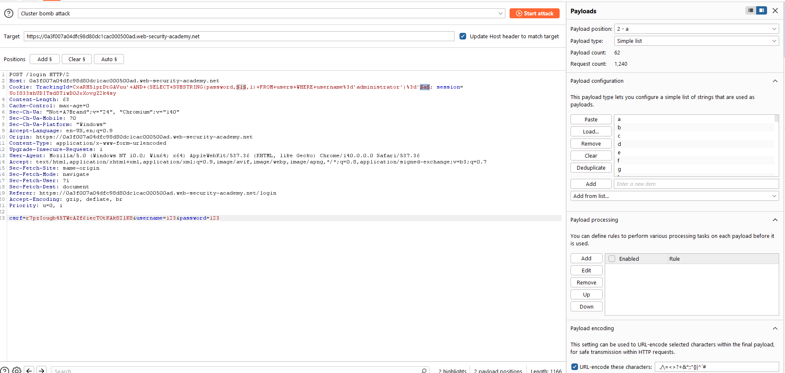
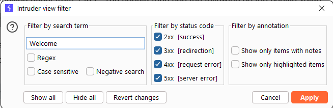
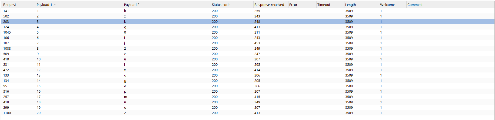

# Lab: Blind SQL injection with conditional responses

**PRACTITIONER**

This lab contains a blind SQL injection vulnerability. The application uses a tracking cookie for analytics, and performs a SQL query containing the value of the submitted cookie.

The results of the SQL query are not returned, and no error messages are displayed. But the application includes a Welcome back message in the page if the query returns any rows.

The database contains a different table called users, with columns called username and password. You need to exploit the blind SQL injection vulnerability to find out the password of the administrator user.

To solve the lab, log in as the administrator user.

## Write-up

Dùng Burp Suite chặn request rồi sửa cookie TrackingId.
TrackingId=xyz' AND '1'='1

Nếu thấy Welcome back thì điều kiện đúng. Đổi sang:

TrackingId=xyz' AND '1'='2

Nếu Welcome back biến mất thì mình đã có cách phân biệt True/False.

Sau đó dò độ dài password bằng LENGTH(password) cho tới khi Welcome back không còn xuất hiện. Password của lab này dài 20 ký tự.
Khi đã biết độ dài, dùng Burp Intruder để dò từng ký tự bằng SUBSTRING(). Trackingid=xyz' AND (SELECT SUBSTRING(password,1,1) FROM users WHERE username='administrator')='a

