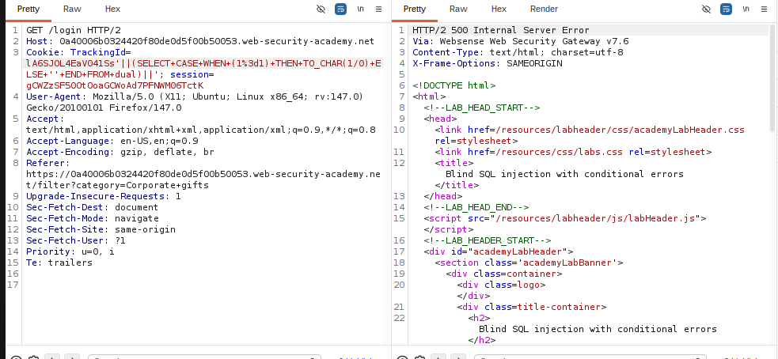
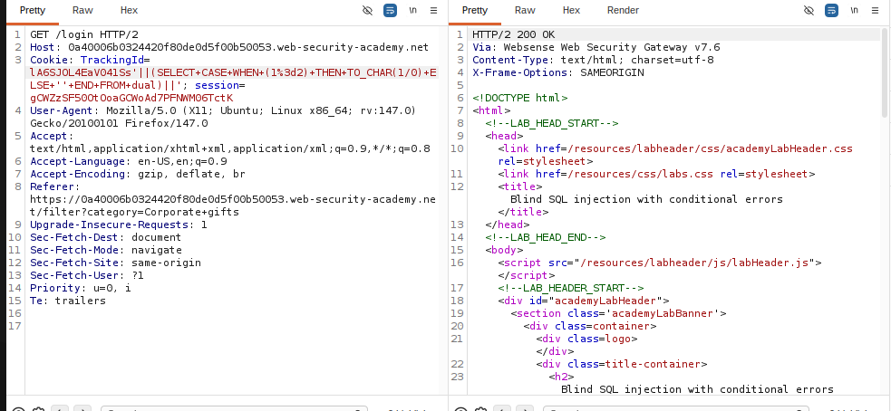

# Lab: Blind SQL injection with conditional errors

**PRACTITIONER**

This lab contains a blind SQL injection vulnerability. The application uses a tracking cookie for analytics, and performs a SQL query containing the value of the submitted cookie.

The results of the SQL query are not returned, and the application does not respond any differently based on whether the query returns any rows. If the SQL query causes an error, then the application returns a custom error message.

The database contains a different table called users, with columns called username and password. You need to exploit the blind SQL injection vulnerability to find out the password of the administrator user.

To solve the lab, log in as the administrator user.

## Write-up

Lab này vẫn là blind SQLi qua TrackingId, nhưng thay vì nhìn Welcome back thì mình dựa vào việc response có báo lỗi hay không.
Dựa vào cheat sheet cho conditional error: ELECT CASE WHEN (YOUR-CONDITION-HERE) THEN TO_CHAR(1/0) ELSE NULL END FROM dual 
Đầu tiên test payload kiểu điều kiện gây lỗi có kiểm soát:
TrackingId=xyz'||(SELECT CASE WHEN (1=1) THEN TO_CHAR(1/0) ELSE '' END FROM dual)||'

Nếu điều kiện true thì có lỗi, false thì không lỗi. Từ đó mình dùng đúng mẫu này để dò từng ký tự password của administrator.
Đây là khi true: 

Đây là khi flase:

Và tương tự như các lab trên sau khi đã xác định được mệnh đề true/false.
