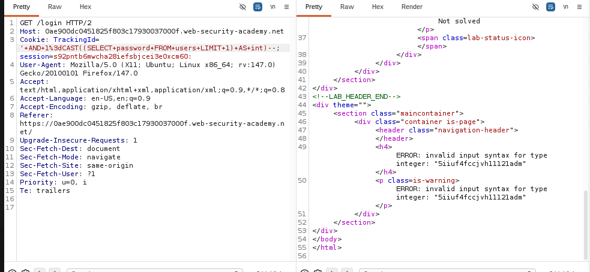

# Lab: Visible error-based SQL injection

**PRACTITIONER**

This lab contains a SQL injection vulnerability. The application uses a tracking cookie for analytics, and performs a SQL query containing the value of the submitted cookie. The results of the SQL query are not returned.

The database contains a different table called users, with columns called username and password. To solve the lab, find a way to leak the password for the administrator user, then log in to their account.

## Write-up

Lab này là error-based SQLi nhìn thấy trực tiếp dữ liệu bị lộ trong thông báo lỗi.

Em chặn request và sửa TrackingId để ép DB cast password sang kiểu số, từ đó password bị lộ ngay trong error message:

Cookie: TrackingId=' AND 1=CAST((SELECT password FROM users LIMIT 1) AS int)--

Khi server trả về lỗi convert kiểu dữ liệu, trong message sẽ lòi ra password thật của administrator.

